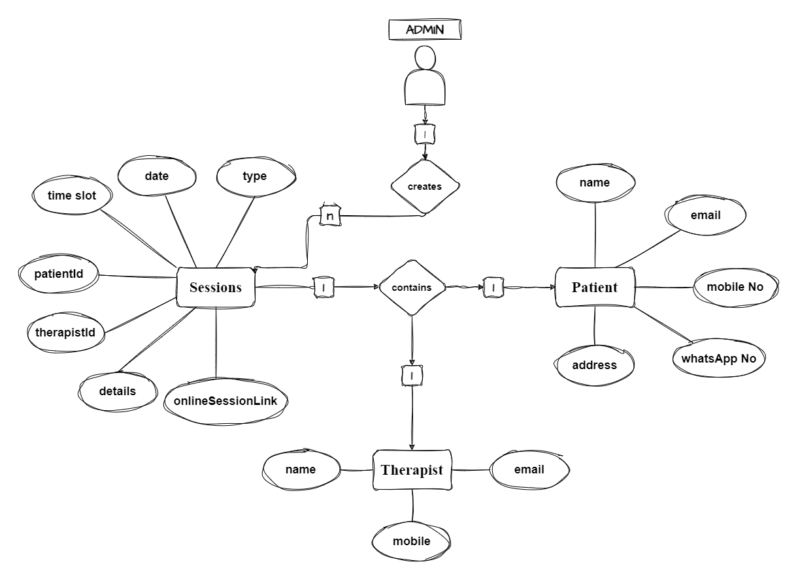

# Session-Management

A Backend implementation of session Management using Node + MongoDB + TypeScript + Express + Mongoose

## Installation

1. Clone the repository:

```bash
git clone https://github.com/ptranquil/session-management.git
```

2. Install the dependencies
3. Give the DB url, provide url for the localhost or any atlas connection and provide port no
4. Start using npm start
5. Install the postman collection, plug and play
6. If facing DB connection issue, double check the path of the DB provided with proper DB name

```bash
//ENV file Example
MONGO_URI = "mongodb://0.0.0.0:27017/"
PORT = 3000
DATABASE_NAME = "test"
```

## Entity-Relationship diagram


